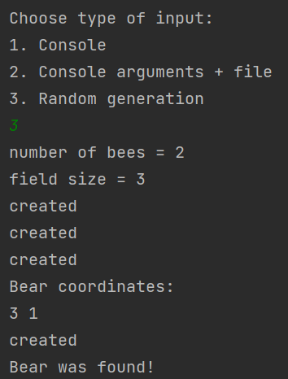
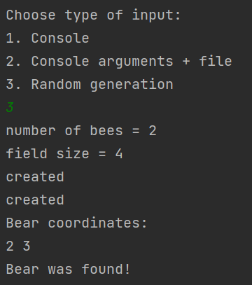
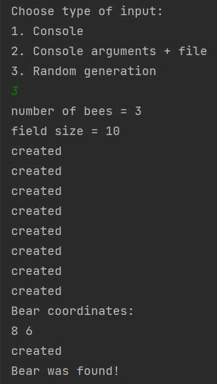
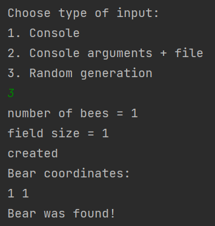
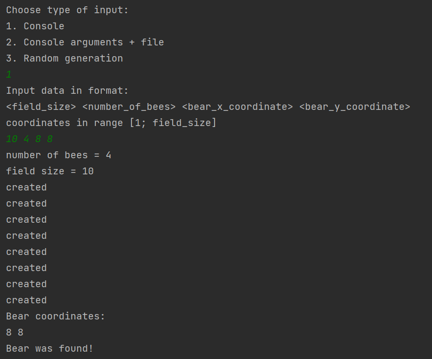
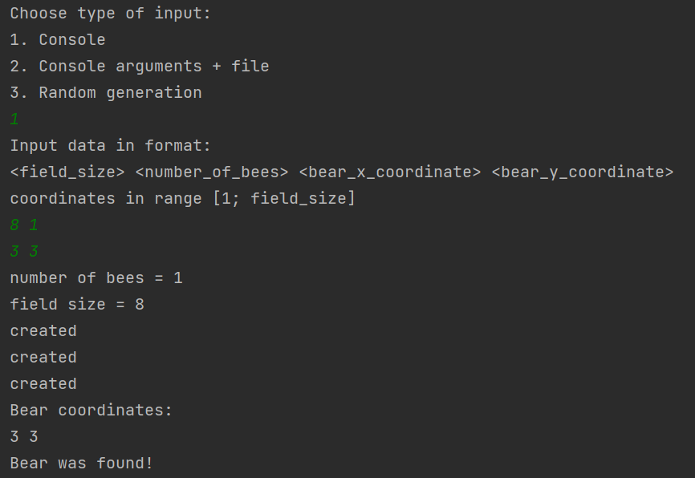
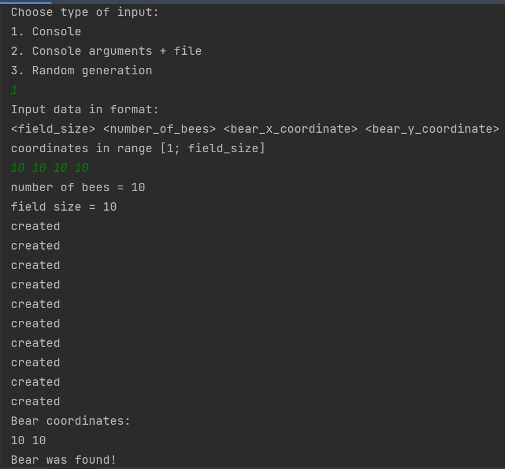

# ИДЗ_4

## Хасанов Анвар, БПИ216, Вариант 27

Примечание: работа по критериям на 8

### Постановка задачи

В данной задаче нужно разработать принцип “поиска” элемента. В качестве элемента выступает Винни-Пух, в качестве ищеек - пчелы. 

Пчелы ищут медведя в секторах леса. В данной задаче лес - это двумерный массив. Сектор - это элемент массива. 

В секторе может быть 3 значения:

- 0 - пустой сектор, где не была пчела
- -1 - пустой сектор, где была пчела
- 1 - сектор, где находится медведь

Сначала запускается группа всех пчел, которые проверяют по одному ряду леса. После возвращения на базу они проверяют, был ли найден медведь, если найден, то все хорошо (не медведю), если не найден, то они снова проверяют по одному ряду. И так далее, пока не будет найден медведь.

### Использование параллелизма

В данной задаче будем использовать параллелизм так: создадим кол-во потоков, равное числу пчел. Каждый поток будет проверять свой ряд. У всех будет доступ к глобальной переменной, найден ли медведь. Это парадигма портфеля задач. 

Когда пчелы возвращаются на базу, то идет синхронизация потоков для последующей работы. В этот момент проверяется, найден ли был медведь. 

### Входные данные

В данной программе есть возможность вводить данные тремя способами:

- Из консоли руками
- Из файла, причем название файлов передаются в аргументах командной строки
- Рандомная генерация данных

В самой программе есть интерактивное взаимодействие с пользователем, поэтому ничего сложного нет

### Код программы

[main.cpp](sw4/main.cpp)

```cpp
#include <iostream>
#include <vector>
#include <random>
#include <pthread.h>
#include <fstream>

int field_size;
int numberOfBees;
bool isFound = false;
bool isFileOutput = false;
std::string outputPath;
// 1 - есть медведь, 0 - медведя нет, -1 - пчела была в этой клетке
std::vector<std::vector<int>> field;

pthread_mutex_t mutex;

// Рандомная генерация входных данных
void randomGenerate();

// Ввод данных из консоли
void console();

// Считывание аргументов командной строки
bool consoleArguments(int argc, char **argv);

// Инициализация вектора нулями
void initializeField(int);

// Метод для поиска медведя
// Этот метод передается в потоки
void *findBear(void *);

void print(std::string&);

void print(const std::string& message) {
    if (isFileOutput) {
        std::ofstream fout(outputPath);
        fout << message;
    } else {
        std::cout << message;
    }
}

int main(int argc, char **argv) {
    std::cout << "Choose type of input: \n"
                 "1. Console\n"
                 "2. Console arguments + file\n"
                 "3. Random generation\n";
    std::string command;
    bool isCorrectCommand = false;
    std::cin >> command;
    // Здесь выбирается, как вводить данные
    while (!isCorrectCommand) {
        if (command == "1") {
            console();
            isCorrectCommand = true;
        } else if (command == "2") {
            if (!consoleArguments(argc, argv)) {
                return 0;
            }
            isFileOutput = true;
            isCorrectCommand = true;
        } else if (command == "3") {
            randomGenerate();
            isCorrectCommand = true;
        } else {
            std::cout << "Неверный ввод";
        }
    }
    print("number of bees = " + std::to_string(numberOfBees) + "\n");
    print("field size = " + std::to_string(field_size) + "\n");
    // Создаем массив потоков
    pthread_t threads[numberOfBees];
    for (int i = 0; i < field_size / numberOfBees + 1; i++) {
        // Создаем потоки
        for (int j = 0; j < numberOfBees; j++) {
            int arg = i * numberOfBees + j;
            pthread_create(&threads[j], nullptr, findBear, &arg);
            print("created\n");
        }
        // Ждем пока все пчелки сделают "обход"
        for (int j = 0; j < numberOfBees; j++) {
            pthread_join(threads[j], nullptr);
        }
        // Если медведь был найден, то выходим, иначе снова запускаем пчелок
        if (isFound) {
            print("Bear was found!");
            break;
        }
    }
    return 0;
}

void randomGenerate() {
    std::random_device r;
    std::default_random_engine e1(r());
    std::uniform_int_distribution<int> uniform_dist(1, 10);
    // Размер поля [1;100]
    field_size = uniform_dist(e1);
    std::uniform_int_distribution<int> uniform_dist1(1, field_size);
    // Количество пчел [1;100]
    numberOfBees = uniform_dist1(e1);
    // Координаты медведя
    int x = uniform_dist1(e1);
    int y = uniform_dist1(e1);
    initializeField(field_size);
    field[x - 1][y - 1] = 1;
}

void console() {
    std::cout << "Input data in format: \n"
                 "<field_size> <number_of_bees> <bear_x_coordinate> <bear_y_coordinate>\n"
                 "coordinates in range [1; field_size]\n";
    int x, y;
    std::cin >> field_size >> numberOfBees >> x >> y;
    initializeField(field_size);
    field[x - 1][y - 1] = 1;
}

bool consoleArguments(int argc, char **argv) {
    // Проверяем, что ввели 2 аргумента
    if (argc != 3) {
        std::cout << "Must be 2 arguments!";
        return false;
    }
    std::ifstream fin(*(argv + 1));
    outputPath = *(argv + 2);
    int x, y;
    fin >> field_size >> numberOfBees >> x >> y;
    initializeField(field_size);
    field[x - 1][y - 1] = 1;
    return true;
}

void *findBear(void *i) {
    bool isFoundLocally = false;
    int x = *((int *) i);
    int y = 0;
    // Проходимся по ряду чисел
    while (!isFoundLocally) {
        if (x >= field_size || y >= field_size) {
            break;
        }
        // Если еще никто не проверял сектор
        if (field[x][y] != -1) {
            if (field[x][y] == 1) {
                print("Bear coordinates:\n");
                print(std::to_string(x + 1) + " " + std::to_string(y + 1) + "\n");
                isFoundLocally = true;
                isFound = true;
            }
            // Если нашли медведя
        } else if (field[x][y] == 0) {
            // Безопасно изменяем значение переменной
            pthread_mutex_lock(&mutex);
            field[x][y] = -1;
            pthread_mutex_unlock(&mutex);
        }
        if (++y == field_size) {
            break;
        }
    }
}

void initializeField(int size) {
    // Заполняем поле
    for (int i = 0; i < size; i++) {
        field.emplace_back(std::vector<int>(size, 0));
    }
}
```

Попробуем сгенерировать данные рандомно и посмотрим, что выводит программа



Для удобства будем выводить, когда создается поток (выводится created)

### Пояснений использования параллелизма

```cpp
for (int j = 0; j < numberOfBees; j++) {
            int arg = i * numberOfBees + j;
            pthread_create(&threads[j], nullptr, findBear, &arg);
            std::cout << "created\n";
        }
```

В данном фрагменте создается numberOfBees потоков, в которые параллельно будет выполняться функция findBear, в данную функцию передаем ряд, который нужно проверить пчеле.

```cpp
for (int j = 0; j < numberOfBees; j++) {
            pthread_join(threads[j], nullptr);
        }
```

Далее ждем, пока все эти потоки отработают. Идет проверка, найден ли медведь, если нет, то снова запускаем цикл, описанный выше. 

```cpp
else if (field[x][y] == 0) {
            // Безопасно изменяем значение переменной
            pthread_mutex_lock(&mutex);
            field[x][y] = -1;
            pthread_mutex_unlock(&mutex);
        }
```

В данном фрагменте изменяется общая переменная field[x][y]. Чтобы все произошло в безопасном режиме, то блокируем эту переменную, позволяя изменять только одному потоку. 

### Тестирование

Выделим три этапа тестирования: 

- Передача данных через консоль
- Передача данных через файл
- Генерация данных рандомно

1) Начнем с рандома:

Запустим программу 3 раза, посмотрим на результат







Видим, что каждый раз медведь находится. Также если посчитать общее число созданных потоков, то можно заметить, что (их число = кол-во пчел * кол-во “рейсов”)

Для изменения границ рандома нужно изменить строку

```cpp
std::uniform_int_distribution<int> uniform_dist(1, 10);
```

Вместо 1 и 10 можно написать другие границы

2) Теперь введем данные из консоли







Для удобства показываются подсказки к вводу данных. Видно, что пчелы находят медведя

3) Введем названия файлов в аргументы.

Пример в CLion


Данные в input.txt

`10 4 4 4`

Данные в output.txt

```
number of bees = 4
field size = 10
created
created
created
created
Bear coordinates:
4 4
Bear was found!
```

==============================================

Данные в input.txt

`10 10 10 10`

Данные в output.txt

```
number of bees = 10
field size = 10
created
created
created
created
created
created
created
created
created
created
Bear coordinates:
10 10
Bear was found!
```

Больше тестов можно посмотреть [здесь](sw4/cmake-build-debug/tests)

### Вывод

Использование потоков уменьшило время работы программы. Правда это не сильно заметно на небольших значениях. 

Программа работает корректно
